# 전기차 보조금 신청 자동화 매크로

`ev.or.kr` 의 판매자 신청서를 Selenium 으로 자동 작성·제출하는 매크로 분석 문서.

| 항목 | 내용 |
| --- | --- |
| 원본 노트북 | `C:\Users\ssson\macro-prj\Untitled.ipynb` |
| 대상 사이트 | <https://ev.or.kr/ev_ps/ps/seller/sellerApplyform?car_type=11> |
| 자동화 도구 | Selenium 4 + 기존 Chrome 디버거 세션 attach |
| 환경설정 | `env1.env` |
| 셀 구성 | Cell 1 = 신청서 작성 / Cell 2 = 첨부 + 제출 |

---

## 목차

1. [개요](#1-개요)
2. [실행 환경](#2-실행-환경)
3. [환경변수 매핑](#3-환경변수-매핑)
4. [전체 플로우차트](#4-전체-플로우차트)
5. [Cell 1 · 신청서 작성](#5-cell-1--신청서-작성)
6. [Cell 2 · 파일 첨부 & 지원신청](#6-cell-2--파일-첨부--지원신청)
7. [예외 처리 패턴](#7-예외-처리-패턴)
8. [개선 아이디어](#8-개선-아이디어)
9. [실행 전 체크리스트](#9-실행-전-체크리스트)

---

## 1. 개요

이 매크로는 **`env1.env` 의 신청 정보를 읽어** Selenium 으로 보조금 신청 폼을 자동 입력하고, **첨부파일 업로드와 최종 지원신청 제출** 까지 한 번에 처리한다.

핵심 특징은 다음과 같다.

- **Chrome DevTools 모드** (`debuggerAddress=127.0.0.1:9222`) 로 이미 로그인된 브라우저에 attach.
- 모든 신청 값은 `env1.env` 외부 파일로 분리 → 신청 건마다 환경변수만 교체해 재실행.
- `readonly` 필드는 `execute_script` 로 JS 직접 주입.
- 새 창(주소 검색·첨부·코드검증) 처리는 **핸들 차분(set diff)** 패턴으로 통일.
- 보안문자(랜덤 코드)는 `span.guide` 의 텍스트를 **`[::-1]` 로 뒤집어서** 통과.

---

## 2. 실행 환경

### 2.1 브라우저 사전 준비

Chrome 을 디버깅 포트 모드로 띄워두고, ev.or.kr 에 미리 로그인해야 한다.

```bash
chrome.exe --remote-debugging-port=9222 --user-data-dir="C:\chrome-debug"
```

### 2.2 Python 패키지

```bash
pip install selenium webdriver-manager python-dotenv
```

### 2.3 Selenium 옵션

```python
opts = Options()
opts.add_argument("--disable-popup-blocking")
opts.add_experimental_option("debuggerAddress", "127.0.0.1:9222")

driver = webdriver.Chrome(options=opts)
wait = WebDriverWait(driver, 10)
```

> 팝업 차단 해제는 주소 검색 · 첨부 · 코드검증 창이 모두 `window.open` 으로 뜨기 때문에 필수.

---

## 3. 환경변수 매핑

`env1.env` 의 각 키가 폼의 어떤 필드에 들어가는지 정리한 표.

### 3.1 신청 기본 정보

| 환경변수 | 필드 ID | 입력 방식 | 설명 |
| --- | --- | --- | --- |
| `APPLICATION_TYPE` | `req_kind` | `Select` | 신청유형 |
| `CONTRACT_DAY` | `contract_day` | JS 주입 | 계약일자 (readonly) |
| `CAR_MODEL` | `model_cd` | `Select` | 차종 |
| `CAR_COUNT` | `req_cnt` | `send_keys` | 신청대수 (정수) |
| `DELIVERY_DATE` | `delivery_sch_day` | JS 주입 | 출고예정일 (readonly) |

### 3.2 연락처 / 기관

| 환경변수 | 필드 ID | 설명 |
| --- | --- | --- |
| `PHONE` | `phone` | 전화 |
| `MOBILE` | `mobile` | 휴대폰 |
| `EMAIL` | `email` | 이메일 |
| `ORG_NAME` | `req_nm`, `pri_busi_nm` | 기관명 / 개인사업장명 |
| `APP_GUBUN` | `grp_reqst_se` | 신청구분 (Select) |
| `NAME` | `ceo` | 대표자 |
| `B_NUM` | `birth2` | 법인(생년)번호 |
| `S_NUM` | `busi_no` | 사업자번호 |

### 3.3 판매자 / 첨부

| 환경변수 | 필드 ID | 설명 |
| --- | --- | --- |
| `AGENCY_PHONE` | `seller_phone` | 판매처 전화 |
| `CONTACT_NAME` | `contact_nm` | 담당자명 |
| `CONTACT_MOBILE` | `contact_mobile` | 담당자 휴대폰 |
| `MANUFACTURER_ID` | `seller_mgrid` | 판매자 매니저 ID |
| `ADDRESS` | (팝업) `keyword` | 주소 검색어 |
| `ADDRESS2` | `rtAddrDetail` | 상세주소 |
| `FILE1` | `filename` × 3 | 첨부파일 절대경로 (A · A2 · A3 슬롯에 동일 파일 업로드) |

### 3.4 미사용 / 예비

`SEARCH`, `BIRTH_DATE`, `GENDER` 는 정의만 되어 있고 코드에서 직접 사용되지 않는다.

---

## 4. 전체 플로우차트

```mermaid
flowchart TD
    Start([시작]) --> LoadEnv[env1.env 로드<br/>환경변수 읽기]
    LoadEnv --> ConnectChrome[Chrome 연결<br/>127.0.0.1:9222<br/>debuggerAddress]
    ConnectChrome --> FillBasic[기본 정보 입력]

    subgraph S1[Cell 1 · 신청서 작성]
        FillBasic --> F1[신청유형 select<br/>req_kind]
        F1 --> F2[계약일자 JS 주입<br/>contract_day]
        F2 --> F3[차종 select<br/>model_cd]
        F3 --> F4[신청대수 입력<br/>req_cnt]
        F4 --> F5[출고예정일 JS 주입<br/>delivery_sch_day]
        F5 --> F6[연락처 입력<br/>phone / mobile / email]
        F6 --> F7[기관명 입력<br/>req_nm]
        F7 --> F8[신청구분 select<br/>grp_reqst_se]
        F8 --> F9[대표자/법인번호/<br/>사업자번호/사업장명]
        F9 --> F10[판매자 정보 입력<br/>seller_phone / contact_*<br/>seller_mgrid]

        F10 --> AddrPopup{{주소 검색 팝업}}
        AddrPopup --> A1[팝업 버튼 클릭<br/>addrPopup]
        A1 --> A2[새 창 핸들 전환]
        A2 --> A3[keyword에 ADDRESS 입력]
        A3 --> A4[searchUrlJuso 검색]
        A4 --> A5["setMaping(1) 첫 결과 클릭<br/>스크롤 + JS click 재시도"]
        A5 --> A6[상세주소 입력<br/>rtAddrDetail]
        A6 --> A7[setParent 클릭<br/>부모창 반영]
        A7 --> A8[부모 창으로 복귀]

        A8 --> Save[goSave 클릭]
        Save --> Alert1{Confirm Alert?}
        Alert1 -->|Yes| Accept1[alert.accept]
        Alert1 -->|TimeoutException| Skip1[alert 안 뜸 로그]
        Accept1 --> NewWin
        Skip1 --> NewWin

        NewWin[저장 후 새창 전환] --> Captcha[랜덤 코드 검증]
        Captcha --> C1[span.guide 텍스트 추출]
        C1 --> C2["문자열 거꾸로 뒤집기 [::-1]"]
        C2 --> C3[randeomChk에 입력]
        C3 --> C4[goCompare 클릭]
        C4 --> Back1[부모 창 복귀]
    end

    Back1 --> Cell2Start[Cell 2 시작]

    subgraph S2[Cell 2 · 파일 첨부 & 지원신청]
        Cell2Start --> LoadFile[FILE1 경로 로드]
        LoadFile --> Loop{첨부 루프<br/>A / A2 / A3}

        Loop --> H1[popupAttachFile id 클릭]
        H1 --> H2[새창 전환 + readyState complete]
        H2 --> H3["#filename input 탐색"]
        H3 --> H4[JS로 hidden/disabled 해제<br/>display/visibility/size 강제]
        H4 --> H5[send_keys 파일경로<br/>실패 시 재시도 2회]
        H5 --> H6[goSave 클릭<br/>팝업 form 내부]
        H6 --> H7[자식창 alert 수락]
        H7 --> H8[자식창 닫힘 대기]
        H8 --> H9[부모창 복귀]
        H9 --> H10[부모창 alert 추가 수락]
        H10 -->|다음 ID| Loop
        Loop -->|완료| Apply

        Apply["goApply(101) 클릭<br/>지원신청"] --> ApplyAlert[alert 수락]
    end

    ApplyAlert --> End([끝])

    classDef io fill:#fef3c7,stroke:#d97706,stroke-width:1px;
    classDef popup fill:#dbeafe,stroke:#2563eb,stroke-width:1px;
    classDef alert fill:#fee2e2,stroke:#dc2626,stroke-width:1px;
    classDef terminal fill:#dcfce7,stroke:#16a34a,stroke-width:2px;

    class LoadEnv,LoadFile io
    class AddrPopup,NewWin,H2 popup
    class Alert1,Accept1,Skip1,H7,H10,ApplyAlert alert
    class Start,End terminal
```



> Mermaid 원본은 [`flowchart.mermaid`](./flowchart.mermaid) 파일로도 저장되어 있다.

---

## 5. Cell 1 · 신청서 작성

### 5.1 폼 채우기 패턴

세 가지 패턴이 반복된다.

| 패턴 | 적용 필드 | 코드 예시 |
| --- | --- | --- |
| Select | 신청유형, 차종, 신청구분 | `Select(driver.find_element(By.ID, "req_kind")).select_by_visible_text(VALUE)` |
| 일반 input | 연락처, 기관명, 사업자번호 등 | `wait.until(EC.element_to_be_clickable(...)).send_keys(VALUE)` |
| readonly + JS 주입 | 계약일자, 출고예정일 | `driver.execute_script("document.getElementById('...').value = '...'")` |

### 5.2 주소 검색 팝업

`/ev_ps/addrlink/addrPopup` 으로 열리는 자식 창을 **핸들 차분** 으로 잡는다.

```python
parent2 = driver.current_window_handle
before2 = set(driver.window_handles)

open_btn.click()  # addrPopup

wait.until(lambda d: len(d.window_handles) > len(before2))
child2 = (set(driver.window_handles) - before2).pop()
driver.switch_to.window(child2)
```

검색 결과 첫 항목(`setMaping('1')` 링크)은 **`StaleElementReferenceException` 재시도 + JS 클릭** 으로 오버레이/리렌더링 이슈를 회피한다.

```python
for _ in range(3):
    try:
        a = driver.find_element(By.XPATH, "//a[contains(@href, \"setMaping('1')\")]")
        driver.execute_script("arguments[0].scrollIntoView({block:'center'});", a)
        driver.execute_script("arguments[0].click();", a)
        break
    except StaleElementReferenceException:
        time.sleep(0.3)
else:
    raise RuntimeError("setMaping('1') 클릭 실패")
```

### 5.3 보안 코드 검증

저장 후 새 창에서 `span.guide` 의 코드를 **그대로 뒤집어서** 입력하면 통과한다.

```python
code_text = driver.find_element(
    By.XPATH, "//tbody/tr[2]/td[2]//span[@class='guide']"
).text.strip()

reversed_code = code_text[::-1]
random_box.send_keys(reversed_code)
```

실행 로그 예시:

```text
원본: d6HXE9F653
뒤집은 값: 356F9EXH6d
```

> 이미지 캡차가 아니라 텍스트가 그대로 노출되어 있어서 가능한 우회 방식. 사이트가 캡차 방식을 바꾸면 즉시 깨진다.

---

## 6. Cell 2 · 파일 첨부 & 지원신청

### 6.1 `accept_any_alert(driver, timeout, retries)`

여러 alert 가 연속으로 뜨는 케이스에 대비해 **반복 수락** 한다.

```python
def accept_any_alert(driver, timeout=3, retries=2):
    for _ in range(retries):
        try:
            WebDriverWait(driver, timeout).until(EC.alert_is_present())
            a = driver.switch_to.alert
            a.accept()
        except (TimeoutException, NoAlertPresentException):
            break
        except NoSuchWindowException:
            break  # 자식창이 alert 처리 도중 닫힘 → 정상 종료
```

### 6.2 `handle_attach(driver, wait, attach_id, file_path)`

첨부 ID 하나당 다음 9단계를 수행한다.

| # | 단계 | 비고 |
| --- | --- | --- |
| 1 | 부모창 핸들 저장 후 `popupAttachFile(id)` 클릭 | A · A2 · A3 |
| 2 | 새 창 전환, `readyState=='complete'` 대기 | |
| 3 | `#filename` input 탐색 | `presence_of_element_located` |
| 4 | JS 로 `disabled`/`readonly` 제거 + `display`/`visibility`/`size` 강제 | 숨김 input 우회 |
| 5 | `send_keys(file_path)` (실패 시 2회 재시도) | `ElementNotInteractable` 대비 |
| 6 | 팝업 폼 내부 `goSave` 버튼 클릭 | form `frm` + `popupAttach/cud` 한정 |
| 7 | 자식창 alert 수락 | `accept_any_alert` |
| 8 | 자식창 닫힘 대기 → 부모창 복귀 | |
| 9 | 부모창 alert 추가 수락 | |

### 6.3 첨부 루프 + 최종 제출

```python
for attach_id in ["A", "A2", "A3"]:
    try:
        handle_attach(driver, wait, attach_id, FILE1)
    except Exception as e:
        print(f"[{attach_id}] 처리 실패 → 스킵: {repr(e)}")
        # 다음 루프를 위해 부모창 복귀 시도
        driver.switch_to.window(driver.window_handles[0])
        continue

apply_btn = wait.until(EC.element_to_be_clickable(
    (By.XPATH, "//button[contains(@onclick, \"goApply('101'\")]")
))
apply_btn.click()
accept_any_alert(driver, timeout=5, retries=2)
```

- 첨부는 동일 파일(`FILE1`) 을 A · A2 · A3 세 슬롯에 순차 업로드.
- 한 건 실패해도 다음 건이 진행되도록 `try/except` 로 감쌈.
- 마지막 `goApply('101')` 가 **실제 제출 버튼**.

---

## 7. 예외 처리 패턴

매크로 전반에서 반복적으로 사용되는 안정화 기법.

| 예외 | 대응 방식 |
| --- | --- |
| `StaleElementReferenceException` | 짧은 sleep 후 재탐색 (최대 3회) |
| `ElementNotInteractableException` | JS 로 `display`/`disabled` 강제 변경 후 재시도 |
| `InvalidArgumentException` (`send_keys`) | 파일 경로 송신 재시도 (2회) |
| `TimeoutException` (alert) | 무시하고 다음 단계로 (alert 미발생 케이스) |
| `NoSuchWindowException` | 자식창이 닫힌 것으로 간주, 부모창으로 복귀 |
| 첨부 1건 실패 | 다음 첨부 ID 로 계속 진행 |

---

## 8. 개선 아이디어

이 코드의 신뢰성을 더 높이려면 다음을 검토할 만하다.

- **`time.sleep` 의존 줄이기.** `WebDriverWait` 으로 충분히 처리 가능한 곳(`time.sleep(0.5)`)이 남아있다.
- **셀렉터 상수화.** 하드코딩된 `id` / `onclick` XPath 가 산재해 있어, 사이트 개편 시 한 번에 깨진다. 한 모듈에 모아두면 유지보수가 쉬워진다.
- **로깅 표준화.** `print` 대신 `logging` 으로 바꾸고 신청 단위 로그 파일을 남기면 사후 추적이 쉽다.
- **재시도 데코레이터.** `ElementClickInterceptedException` 등도 흔하므로 일괄 재시도 데코레이터로 감싸면 코드가 깔끔해진다.
- **N건 일괄 처리.** 현재는 `env1.env` 로 1건만 처리. CSV / 엑셀 입력 → 루프 구조로 확장 여지가 크다.
- **캡차 변경 대비.** 사이트가 코드 노출 방식을 이미지 / 난수화로 바꾸면 `[::-1]` 은 즉시 망가진다. 실패 시 사용자 개입 hook 이 안전.
- **첨부 input 강제 노출.** JS 로 hidden input 을 강제로 보이게 하는 방식은 사이트 정책 변경에 취약하다. 정상 input 우선 시도 → 실패 시에만 fallback 으로 쓰는 구조가 안전.

---

## 9. 실행 전 체크리스트

신청 1건을 돌리기 전에 확인할 것.

- [ ] Chrome 이 `--remote-debugging-port=9222` 로 떠 있다.
- [ ] 해당 Chrome 으로 ev.or.kr 에 **로그인** 되어 있다.
- [ ] 신청 폼 페이지(`sellerApplyform?car_type=11`) 가 **현재 활성 탭** 이다. (스크립트는 `driver.get` 을 호출하지 않는다)
- [ ] `env1.env` 의 모든 필수 값이 채워져 있다.
- [ ] `CAR_COUNT` 는 정수, 날짜는 `YYYY-MM-DD` 포맷이다.
- [ ] `FILE1` 은 절대경로이며 실제 존재하는 파일이다.
- [ ] 다른 alert / 팝업이 미리 떠 있지 않다.
